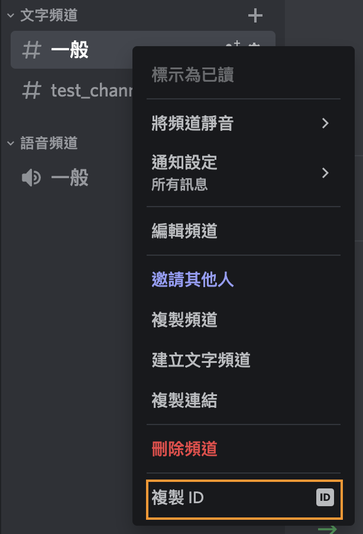
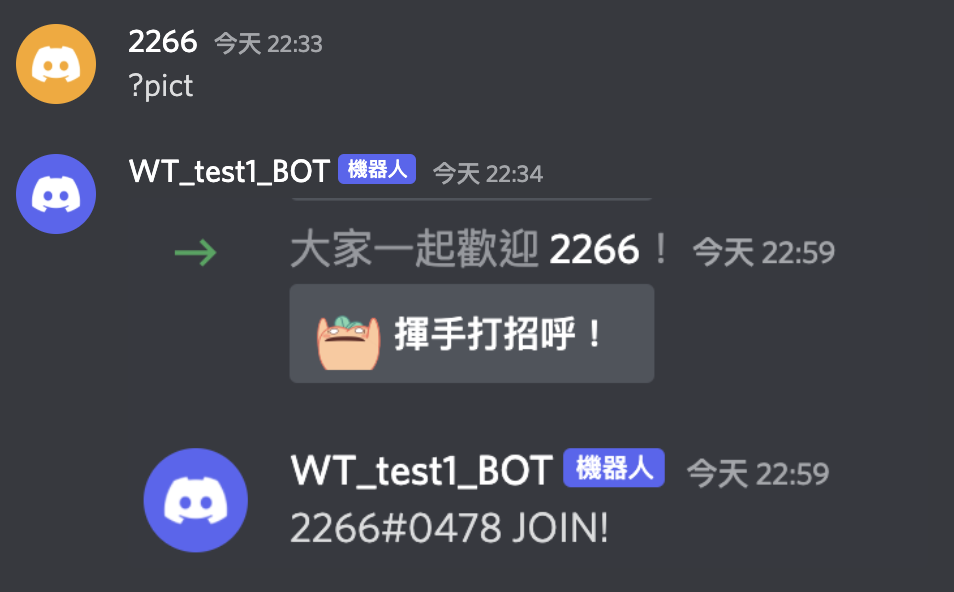
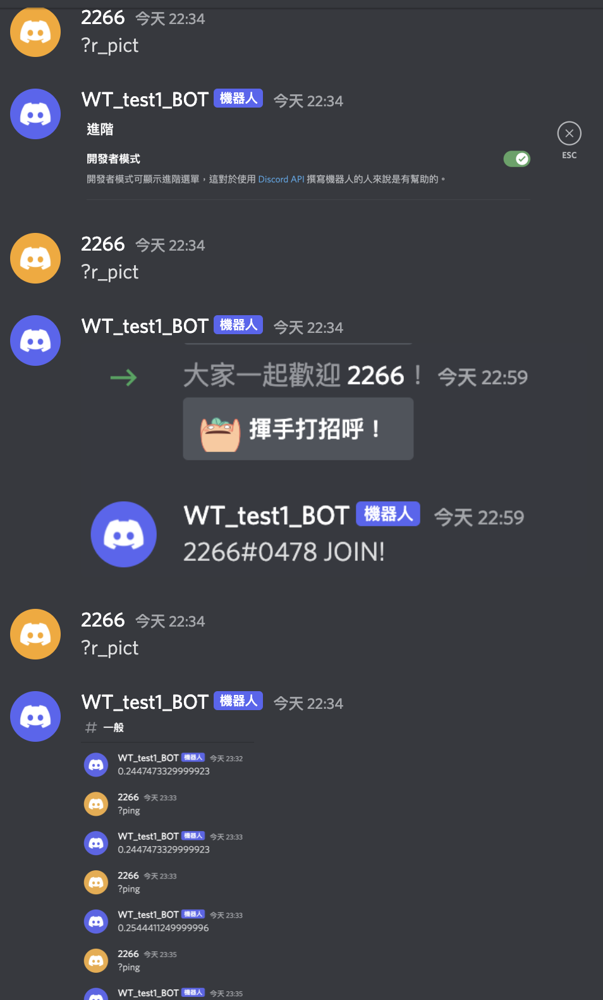
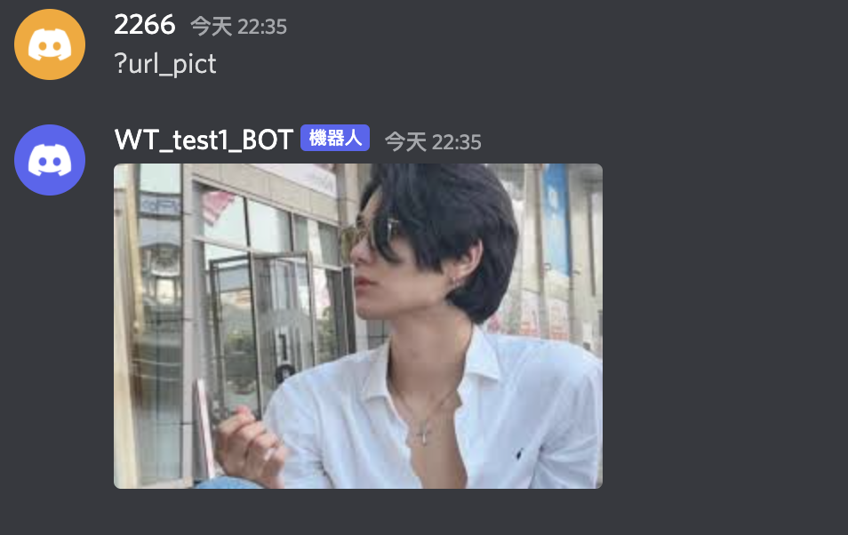
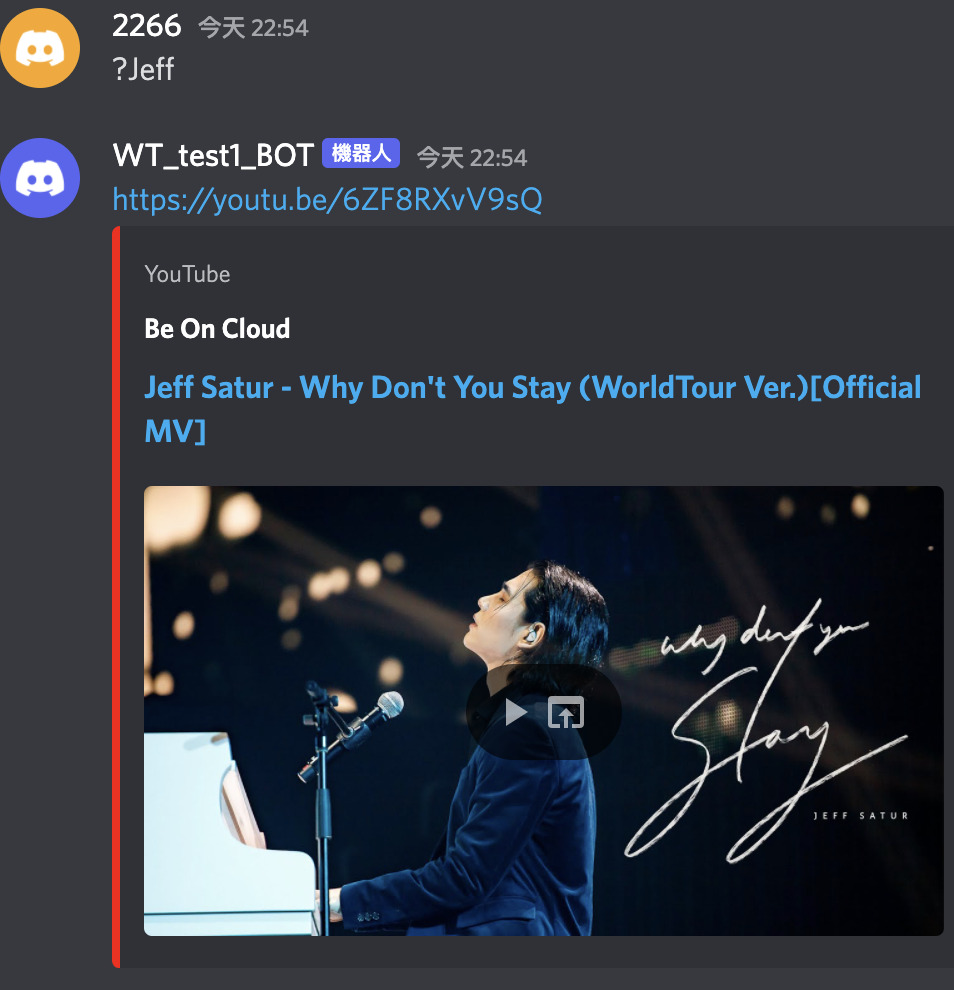

# 基本設定 & Members & Command

### 參考資料
1. [Discord API members](https://discordpy.readthedocs.io/en/latest/api.html?highlight=on_ready#members)
2. [rixinsc Giuhub](https://github.com/rixinsc/Libereus)
3. [Youtube video 1](https://youtu.be/rFJoLrVlEHY)
4. [Youtube video 2](https://youtu.be/P0a7o5hK_Ig)
5. [機器人從0到1超詳細教學](https://hackmd.io/@kangjw/Discordpy%E6%A9%9F%E5%99%A8%E4%BA%BA%E5%BE%9E0%E5%88%B01%E8%B6%85%E8%A9%B3%E7%B4%B0%E6%95%99%E5%AD%B8)
6. [如何创建它并将其添加到服务器](https://appmaster.io/zh/blog/discord-bot-ru-he-chuang-jian-ta-bing-jiang-qi-tian-jia-dao-fu-wu-qi)
7. [event 函式庫 API 查詢](https://discordpy.readthedocs.io/en/latest/api.html#event-reference)
8. [discord.py 官方API](https://discordpy.readthedocs.io/en/latest/api.html)
9. [youtube play list](https://www.youtube.com/watch?v=rFJoLrVlEHY&list=PLSCgthA1Anif1w6mKM3O6xlBGGypXtrtN&index=5)
10. [discord github](https://github.com/discord/discord-api-docs)
11. [discordpygetting-started](https://discordpy.readthedocs.io/en/latest/index.html#getting-started)

> 完整的[CODE](../Code/get_start.py)在這邊
> 小提醒：在Bot中輸入指令help可以看目前有哪些funciton喔！

### 設定
1. 到[discord developers](https://discord.com/developers/applications) New Application => create => 點選側邊欄 Bot => add Bot
2. 前往「OAuth2」， 在「SCOPES」中點選 bot，選擇權限後把下方連結複製到瀏覽器，就可以將機器人邀請進去你自己的伺服器！詳細的步驟[這邊](https://hackmd.io/@kangjw/Discordpy%E6%A9%9F%E5%99%A8%E4%BA%BA%E5%BE%9E0%E5%88%B01%E8%B6%85%E8%A9%B3%E7%B4%B0%E6%95%99%E5%AD%B8)有
3. 新環境記得要安裝discord套件
```
python -m pip install -U discord.py
```
4. 要放連結bot的token，新增一個`.env`檔把token和未來可能會用到其他的敏感資訊收起來
5. Discord 在1.5版本針對安全性上進行了重大更新，所以上面的設定完之後還要再設定其他的東西，接下來才能順利進行！
    - discord developer中的Bot頁面把Privileged Gateway Intents下面的按鈕打開
    
    - 在discord的使用者設定（discord帳號，不是developers喔！） => 進階 => 開發者模式打開，這樣才能複製頻道ID
    

### Initial BOT
- [discord.Intents API](https://discordpy.readthedocs.io/en/latest/api.html#discord.Intents)    
- Intents 可以理解成權限設定，一共有三個分類
```python
# 開啟所有的權限
intents = discord.Intents.all()

# 開啟預設的權限
# 預設的部分是除了presences、members和message_content以外的都有
intents = discord.Intents.default()

# 所有的權限都不開啟
intents = discord.Intents.none()
```
當然，也可以自行設定
```python
# 自行定義要開啟的權限
intents = discord.Intents(message = True, guild = True)
# 另外把reaction打開
intents.reaction = True
```
或是這樣
```python
# 或是在設定好的權限下做調整等等
intents = discord.Intents.default()
# 在default下，把typing和preence關起來
intents.typing = False
intents.preence = False
```  
- 設定完intents後就可以設定Bot了！
```python
# command_prefix是呼叫bot的時候要用的特殊字串
bot = commands.Bot(command_prefix="?", intents=intents)
```
接下來就要開始建置Bot的功能了！

### Final
所有功能都建置好之後加上`bot.run('你的Bot Token')`去啟動寫好的Bot


## event - 成員加入/離開 
- 這邊使用兩個function，Members還有其他的功能，需要的人可以去上面Discord API members的連結看喔！
    1. `on_member_join` 當有成員加入的時候歡迎他
    2. `on_member_remove` 當有成員退出的時候跟他說掰掰
- 去頻道按右鍵 => 複製ID，就可以設定channel ID，讓機器人傳訊息到特定的channel


```python
# get_start.py

@bot.event ##調用 event 函式庫
# 成員加入時
async def on_member_join(member):
    # member參數會去讀取跟member有關的訊息
    channel = bot.get_channel(1026139400796639297)#這裡放剛剛複製的channel ID
    print(f'{member} JOIN!') # 在terminal印出歡迎訊息
    await channel.send(f'{member} JOIN!') # 在Discord channel中送出歡迎訊息
```
- terminal中的訊息


- 到頻道去看有沒有成功讓Bot說話


## command - ping
- ctx是什麼？ctx指的是context，包含[發話者, 發話者id, 所在伺服器, 所在頻道]等內容，讓機器人知道是誰、在哪裡說這個訊息，然後機器人該回應到哪裡(哪個伺服器哪個頻道)。所以如果用這個就不用像上面一樣指定頻道囉！
- 寫command一定會用到ctx喔！
- function的名稱就是我們在bot中要下的指令，不要忘了指令前面要加上前面寫的特殊字串
```python
# 指令 command
@bot.command()
async def ping(ctx):
    # 1000ms = 1s，把延遲時間改成兩個小數點的毫秒
    await ctx.send(f'{round(bot.latency*1000,2)} (ms)')
    #bot.latency指的是延遲時間
```
- 在#一般頻道中的機器人回覆


- 轉到#test_1頻道中，機器人也會自動回覆在#test_1中喔！


## command - 傳送圖片
傳送圖片分成兩種，分別是傳送本機圖片和網路圖片
1. 傳送本機圖片：傳送本機圖片寫了傳送固定檔案，和隨機選取資料夾中檔案送出的方式，詳細的code直接在py檔中看喔！
這邊要注意的是記得要告訴discord說要傳送是檔案而不是一串文字
```python
    pic_path = discord.File('../image/channel_msg.png')
    await ctx.send(file = pic_path)
```
- 到頻道中試試看傳送圖片的指令


- 再看看隨機傳送圖片的功能，相同的"?r_pic"指令下，傳送了不同的圖片


2. 傳送網路圖片：這邊直接google了最近超級喜歡的歌手Jeff Satur的照片網址貼在code中，他的聲音真的超～好聽，歌曲的風格我也很喜歡～私心推薦～哈哈哈！discord可以自己辨識網址傳送圖片，所以send的部分就跟文字訊息一樣就可以囉！


3. 傳送網址：到這邊我突然覺得既然圖片的網址可以辨識，那Youtube的也可以吧！所以我就加上了Jeff的一首歌的Youtube網址，果然是可以辨識的，點播放還可以直接播放～好方便啊！！！ＸＤＤＤＤ


Back to [README](../README.md)