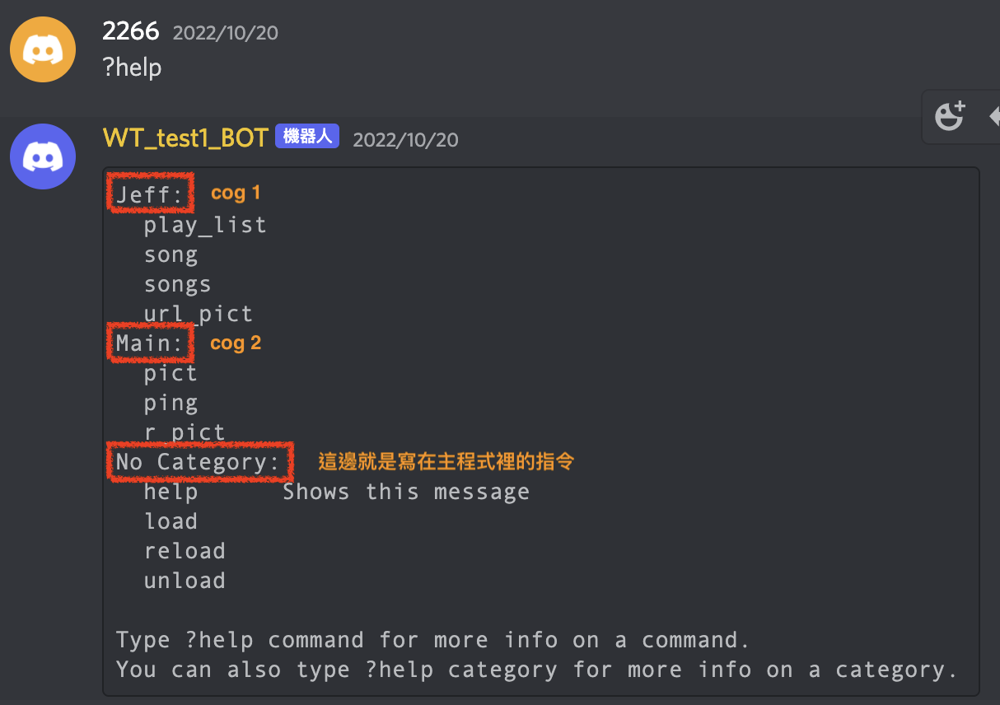
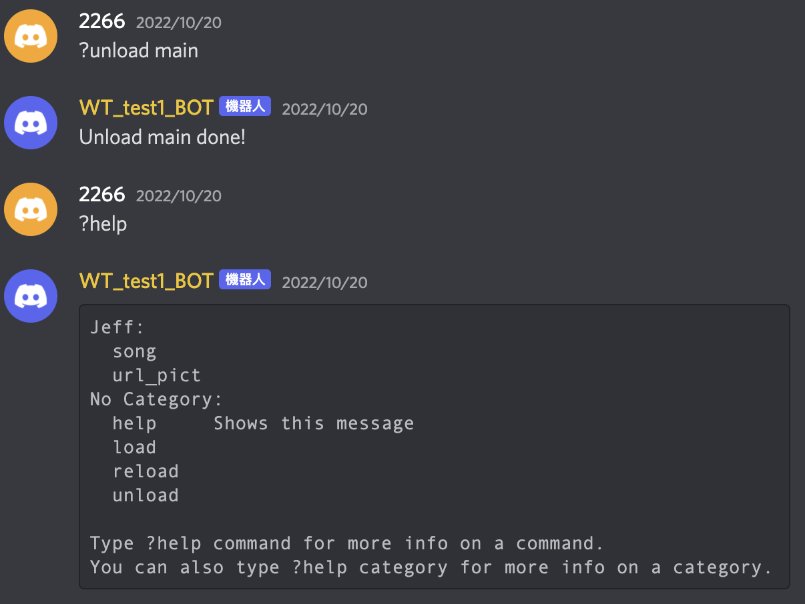
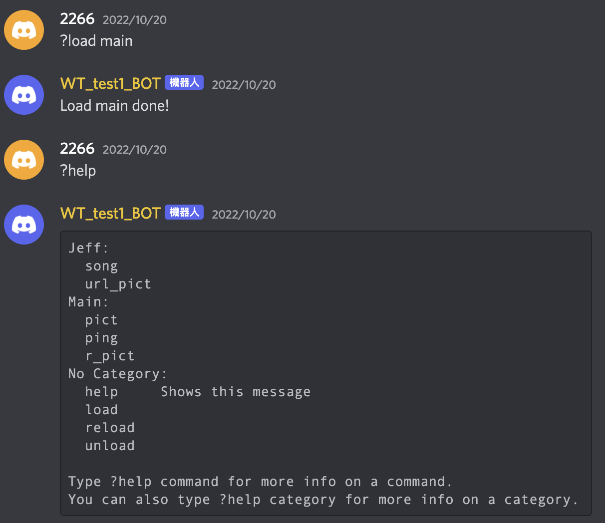
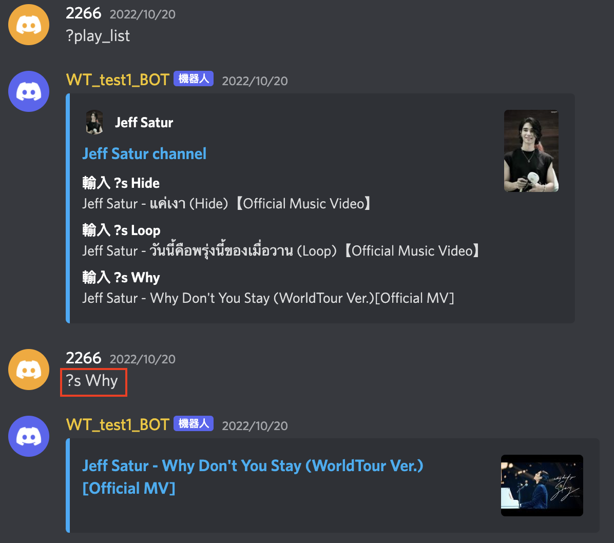

# Cogs & Group => discord 2.0
- 小提醒：discord 2.0把cog的功能改成async了喔！有些教學是舊的版本，嘗試了之後發現舊版本已經不能再建立cog功能了～

### 參考資料
1. [youtube api 教學](https://medium.com/%E5%BD%BC%E5%BE%97%E6%BD%98%E7%9A%84%E8%A9%A6%E7%85%89-%E5%8B%87%E8%80%85%E7%9A%84-100-%E9%81%93-swift-ios-app-%E8%AC%8E%E9%A1%8C/101-%E4%BD%BF%E7%94%A8-youtube-data-api-%E6%8A%93%E5%8F%96%E6%9C%89%E8%B6%A3%E7%9A%84-youtuber-%E5%BD%B1%E7%89%87-mv-d05c3a0c70aa)
2. [Embeds | Discord.py 2.0](https://www.youtube.com/watch?v=urLZoyLUDdE)
3. [Embeds code 生成器](https://cog-creators.github.io/discord-embed-sandbox/)
4. [群組＆子命令](https://youtu.be/NE4yG7e5zq0)
5. [Youtube Cog介紹](https://youtu.be/KnO2-0l3BaM)
6. [Youtube discord 2.0 Cog實作](https://www.youtube.com/watch?v=Z__BE3sAKLU)

## Cogs 的介紹這裡看[youtube](https://youtu.be/KnO2-0l3BaM)
- discord 2.0之後把Cogs改成async，所以寫法跟原來有些不同，詳細的Code看[主程式](Code/cogs.py)和[cmds資料夾](Code/cmds)喔！

### Step 1. 建立[cmd資料夾](Code/cmds)
1. cmd資料夾裡面要放的一些py檔，每一個py檔表示一個Cog(有點像群組，但是跟下面要介紹的群組命令是不一樣的，不要搞混了喔！)
2. py檔中用class的方式增加指令
3. 註冊cog，這邊就跟舊版不同了，舊版不需要async，但2.0的版本需要，所以要改成這樣：
```python
async def setup(bot):
    await bot.add_cog(Main(bot))
```
### Step 2. 建立[主程式](Code/cogs.py)
1. 主程式中把@bot.event留著，command的地方改成要load/unlaid/reload的指令，可以透過這三個指令來操作cogs
2. 把cmds中的檔案都load進來
```python
async def load_cogs():
    for fn in os.listdir('./cmds'):
        if fn.endswith(".py"):
            await bot.load_extension(f'cmds.{fn[:-3]}')
```
3. 啟動Bot也改成async
```python
async def main():
    await load_cogs()
    await bot.start(os.getenv('bot_token'))

if __name__ == '__main__':
    asyncio.run(main())
```

### Step 3. 檢查是否成功
- 利用help來看cog建立是不是成功


- 使用load和unload來確定設定成功\
\



## Group & 子命令 [code](../Code/cmds/jeff.py)
- 群組和子命令有一點點像上面Cog那樣，但是Cog比較像是把指令分類，每個分類下的指令都可以獨立運作。但群組需要先下群組指令後面接子命令。

### Step 1. 建立群組
- `@commands.group()`的這個function就是群組指令
```python
 @commands.group()
    async def s(self,ctx):
       pass
```
### Step 2. 建立子命令
- 透過`@s.command()`來宣告命令屬於`s`這個群組
- function的名稱就是子命令，群組指令和子命令之間以空格隔開，要啟動下面這個指令的話，要打`?s Hide`
```python
 @s.command()
    async def Hide(self,ctx):
        ## your code here
        await #do something 
```
### Step 3. 檢查是否成功
- 這樣就成功囉！


Back to [README](../README.md)