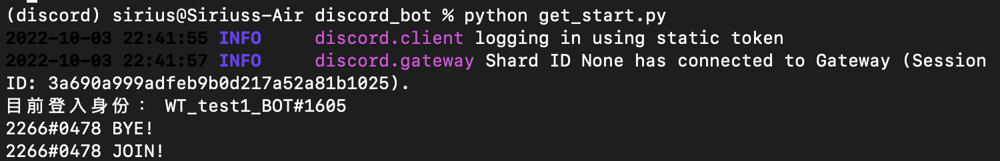
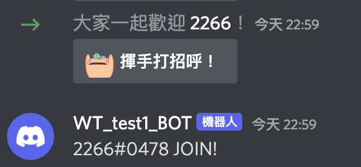
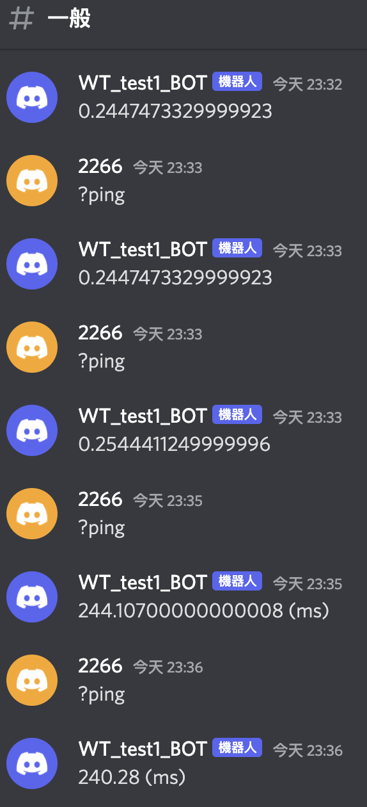
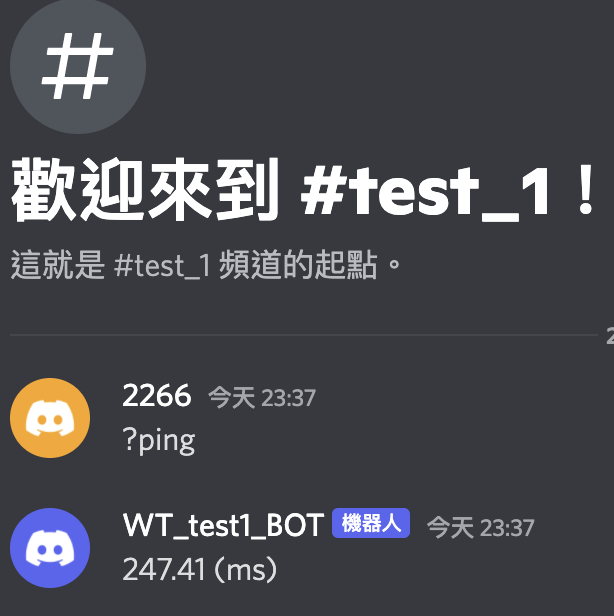

# Members & Command

### 參考資料
1. [Discord API members](https://discordpy.readthedocs.io/en/latest/api.html?highlight=on_ready#members)
2. [rixinsc Giuhub](https://github.com/rixinsc/Libereus)
3. [Youtube video 1](https://youtu.be/rFJoLrVlEHY)
4. [Youtube video 2](https://youtu.be/P0a7o5hK_Ig)

> 完整的[CODE](../Code/get_start.py)在這邊

## 成員加入/離開 
- 這邊使用兩個function，Members還有其他的功能，需要的人可以去上面Discord API members的連結看喔！
    1. `on_member_join` 當有成員加入的時候歡迎他
    2. `on_member_remove` 當有成員退出的時候跟他說掰掰
- 去頻道按右鍵 => 複製ID，就可以設定channel ID，讓機器人傳訊息到特定的channel


```python
# get_start.py

@bot.event ##調用 event 函式庫
# 成員加入時
async def on_member_join(member):
    # member參數會去讀取跟member有關的訊息
    channel = bot.get_channel(1026139400796639297)#這裡放剛剛複製的channel ID
    print(f'{member} JOIN!') # 在terminal印出歡迎訊息
    await channel.send(f'{member} JOIN!') # 在Discord channel中送出歡迎訊息
```
- terminal中的訊息

- 到頻道去看有沒有成功讓Bot說話 \


## command
- ctx是什麼？ctx指的是context，包含[發話者, 發話者id, 所在伺服器, 所在頻道]等內容，讓機器人知道是誰、在哪裡說這個訊息，然後機器人該回應到哪裡(哪個伺服器哪個頻道)。所以如果用這個就不用像上面一樣指定頻道囉！
- 寫command一定會用到ctx喔！
- function的名稱就是我們在bot中要下的指令，不要忘了指令前面要加上前面寫的特殊字串
```python
# 指令 command
@bot.command()
async def ping(ctx):
    # 1000ms = 1s，把延遲時間改成兩個小數點的毫秒
    await ctx.send(f'{round(bot.latency*1000,2)} (ms)')
    #bot.latency指的是延遲時間
```
- 在#一般頻道中的機器人回覆

- 轉到#test_1頻道中，機器人也會自動回覆在#test_1中喔！


Back to [README](../README.md)