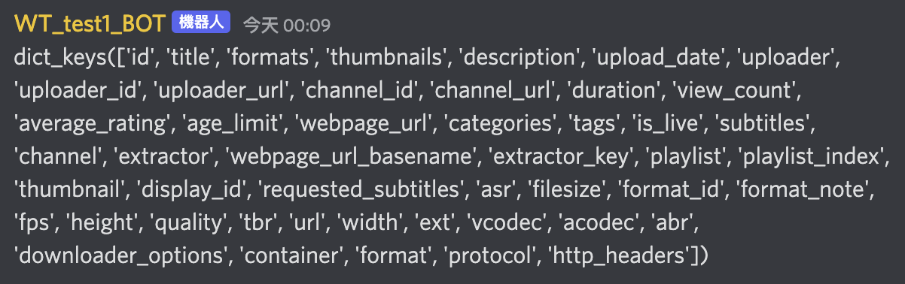

# Music Bot
### 參考資料：
1. [Create a discord music bot using python 1](https://youtu.be/i0nNPidYQ2w)
2. [Create a Music Discord bot using Python 2](https://www.youtube.com/watch?v=dRHUW_KnHLs)
3. [【Proladon】Code a discord bot - EP13 Part2 - 開源 MusicBot](https://www.youtube.com/watch?v=PaaH_vs_56U&list=PLSCgthA1Anif1w6mKM3O6xlBGGypXtrtN&index=22)
4. [YouTubeDL](https://github.com/ytdl-org/youtube-dl#installation)
5. [pawel02/image_bot](https://github.com/pawel02/image_bot/blob/main/music_cog.py)

## 基本設定
- music bot會用到兩個套件，第一個是YouTubeDL，可以去讀取youtube上的影片。第二個是ffmpeg，用來把youtube影片轉成音樂在語音頻道播放，這個套件在discord可以直接調用，在開始寫code之前先裝好喔～
1. YouTubeDL `brew install youtube-dl`
2. ffmpeg:直接到[ffmpeg官網](https://www.ffmpeg.org/download.html)下載，或是用home brew安裝`brew install ffmpeg`
- 小提醒：在播放前要記得先進入語音頻道，不然沒辦法把機器人叫到語音頻道來喔！

## 音樂機器人功能設定
1. 基本設定：先設定空的list，play的時候用load_list去把東西裝到list中，每次?rplay的時候都重新load一次，stop的時候把list清空，不然stop之後還是會重新播放
```python
def __init__(self, bot):
    self.bot = bot
    self.mv_l = []

def load_list(self):
# 把why don't you stay加入play list
    mv_l = mv["V_ids"].tolist()
    mv_l.append("6ZF8RXvV9sQ")
    return mv_l
```

2. 讓機器人加入語音頻道
```python
@commands.command()
async def join(self,ctx):
    channel = ctx.author.voice.channel
    await channel.connect()
```
    這邊也可以設定在特定的語音頻道才開始播放，名稱跟id像下面這樣指定
```python
ctx.author.voice.channel.name == "頻道名稱"
ctx.author.voice.channel.id == 1042422465068023958
```
3. 機器人離開語音頻道
```python
@commands.command()
async def leave(self,ctx):
    await ctx.voice_client.disconnect()
```
4. 停止播放。這邊要注意，停止的時候要清空播放清單，不然還是會繼續播放。很神奇ＸＤ
```python
@commands.command()
async def stop(self, ctx):
    self.mv_l.clear()
    ctx.voice_client.stop()
    await ctx.send('Music Stop')
```
5. 隨機播放：先寫一個播放設定的function，然後把這個function放到隨機播放的指令裡面
-  播放設定function
```python
def next(self, ctx, play_list):
        # 隨機產生數字
        num = random.randint(0,len(play_list)-1)
        # YoutubeDL設定
        YDL_OPTIONS = {'format': 'bestaudio'}
        url = f'https://www.youtube.com/watch?v={play_list[num]}'
        info = YoutubeDL(YDL_OPTIONS).extract_info(url, download=False)
        # url是audio link的key
        ctx.voice_client.play(discord.FFmpegPCMAudio(info['url']), after = lambda e: self.next(ctx, play_list))
        # ctx.send一定要await，所以用asyncio來啟動他
        asyncio.run_coroutine_threadsafe(ctx.send(f'正在播放 📣 {info["title"]} 📣'),self.bot.loop)  
```
    info回傳一個字典，keys如下，音檔的key是url


- 隨機播放的指令
```python
@commands.command()
async def rplay(self,ctx):
    # 設定頻道在test_1才可以有播音樂的功能
    if ctx.channel.name == "test_1": 
        # 播放前把播放清單load進來
        self.mv_l = self.load_list()
        self.next(ctx, self.mv_l)
    else:
        await ctx.send('在test_1頻道才可以播音樂喔～')
```