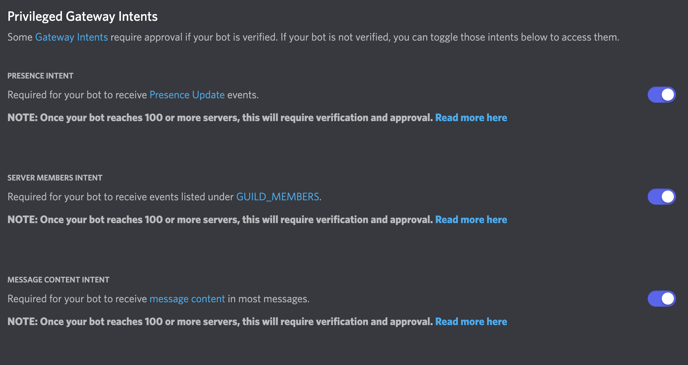
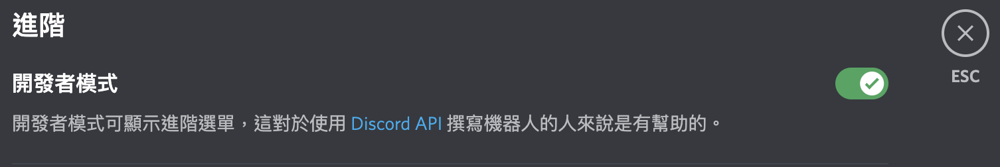

# discord_bot

## Discord Bot 新手上路
從0開始打造自己的Discord Bot筆記

### 參考資料：
1. [機器人從0到1超詳細教學](https://hackmd.io/@kangjw/Discordpy%E6%A9%9F%E5%99%A8%E4%BA%BA%E5%BE%9E0%E5%88%B01%E8%B6%85%E8%A9%B3%E7%B4%B0%E6%95%99%E5%AD%B8)
2. [如何创建它并将其添加到服务器](https://appmaster.io/zh/blog/discord-bot-ru-he-chuang-jian-ta-bing-jiang-qi-tian-jia-dao-fu-wu-qi)
3. [event 函式庫 API 查詢](https://discordpy.readthedocs.io/en/latest/api.html#event-reference)
4. [discord.py 官方API](https://discordpy.readthedocs.io/en/latest/api.html)
5. [youtube play list](https://www.youtube.com/watch?v=rFJoLrVlEHY&list=PLSCgthA1Anif1w6mKM3O6xlBGGypXtrtN&index=5)
6. [discord github](https://github.com/discord/discord-api-docs)
7. [discordpy documentation](https://discordpy.readthedocs.io/en/latest/index.html#getting-started)

### 設定
1. 到[discord developers](https://discord.com/developers/applications) New Application => create => 點選側邊欄 Bot => add Bot
2. 前往「OAuth2」， 在「SCOPES」中點選 bot，選擇權限後把下方連結複製到瀏覽器，就可以將機器人邀請進去你自己的伺服器！詳細的步驟[這邊](https://hackmd.io/@kangjw/Discordpy%E6%A9%9F%E5%99%A8%E4%BA%BA%E5%BE%9E0%E5%88%B01%E8%B6%85%E8%A9%B3%E7%B4%B0%E6%95%99%E5%AD%B8)有
3. 新環境記得要安裝discord套件
```
python -m pip install -U discord.py
```
4. 要放連結bot的token，新增一個`.env`檔把token和未來可能會用到其他的敏感資訊收起來
5. Discord 在1.5版本針對安全性上進行了重大更新，所以上面的設定完之後還要再設定其他的東西，接下來才能順利進行！
    - discord developer中的Bot頁面把Privileged Gateway Intents下面的按鈕打開
    
    - 在discord的使用者設定（discord帳號，不是developers喔！） => 進階 => 開發者模式打開，這樣才能複製頻道ID
    

### Initial BOT
- [discord.Intents API](https://discordpy.readthedocs.io/en/latest/api.html#discord.Intents)    
- Intents 可以理解成權限設定，一共有三個分類
```python
# 開啟所有的權限
intents = discord.Intents.all()

# 開啟預設的權限
# 預設的部分是除了presences、members和message_content以外的都有
intents = discord.Intents.default()

# 所有的權限都不開啟
intents = discord.Intents.none()
```
當然，也可以自行設定
```python
# 自行定義要開啟的權限
intents = discord.Intents(message = True, guild = True)
# 另外把reaction打開
intents.reaction = True
```
或是這樣
```python
# 或是在設定好的權限下做調整等等
intents = discord.Intents.default()
# 在default下，把typing和preence關起來
intents.typing = False
intents.preence = False
```  
- 設定完intents後就可以設定Bot了！
```python
# command_prefix是呼叫bot的時候要用的特殊字串
bot = commands.Bot(command_prefix="?", intents=intents)
```
接下來就要開始建置Bot的功能了！

### 功能設置
1. [基礎功能](Docs/basic.md):event（成員加入、離開等）和 command（傳送圖片等）的使用
2. [把基礎功能寫成cog形式](Code/cmds)：沒有特別寫md檔註解都寫在code裡，主要是把不同功能拆分成不同py檔，然後可以直接在bot中load或unload不同的功能，可以自由選擇要不要用這樣的形式去寫bot～詳細的介紹可以參考[Youtube Cog介紹](https://youtu.be/KnO2-0l3BaM)和[Youtube discord 2.0 Cog實作](https://www.youtube.com/watch?v=Z__BE3sAKLU)
3. 連結錢包、讀取特定NFT properties加入特定頻道 - https://collabland.freshdesk.com/support/home
4. 還沒想到.....

### Final
所有功能都建置好之後加上`bot.run('你的Bot Token')`去啟動寫好的Bot


